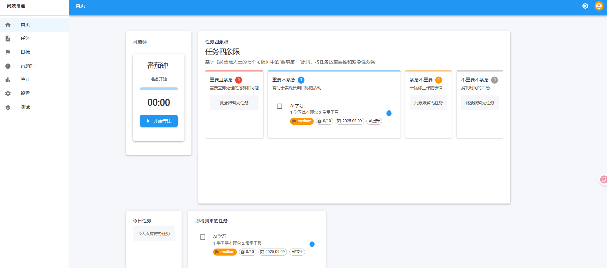

# TODO应用

## 项目概述

TODO应用是一款基于现代Web技术开发的任务管理工具，旨在帮助用户高效地管理日常任务、设定目标并提高工作效率。该应用结合了《高效能人士的七个习惯》和《番茄钟工作法》的核心理念，为用户提供科学的时间管理和任务规划方法。


## 主要功能

- **任务管理**：创建、编辑、删除和分类任务

- **四象限法则**：基于重要性和紧急性的任务分类

- **番茄钟工作法**：科学的时间管理方法

- **目标设定**：创建和跟踪长期、中期和短期目标

- **数据统计**：任务完成情况和工作效率分析

- **个性化设置**：主题切换、番茄钟设置和通知设置


## 技术栈

- **前端框架**：React 18.2.0 + TypeScript 5.8.3
- **UI组件库**：Material-UI (MUI) 7.3.1
- **状态管理**：Zustand 5.0.8
- **路由管理**：React Router DOM 7.8.1
- **数据可视化**：Chart.js 4.5.0 + React-Chartjs-2 5.3.0
- **构建工具**：Vite 7.1.2

## 快速开始

### 安装依赖

```bash
npm install
```

### 启动开发服务器

```bash
npm run dev
```

### 构建生产版本

```bash
npm run build
```

### 预览生产版本

```bash
npm run preview
```

## 项目结构

```
/todo_web
├── public/                  # 静态资源
├── src/
│   ├── assets/              # 项目资源文件
│   ├── components/          # 组件目录
│   ├── contexts/            # React上下文
│   ├── docs/                # 项目文档
│   │   ├── requirements.md  # 需求文档
│   │   ├── user_manual.md   # 用户手册
│   │   └── technical_guide.md # 技术指南
│   ├── hooks/               # 自定义钩子
│   ├── models/              # 数据模型定义
│   ├── pages/               # 页面组件
│   ├── services/            # 服务层
│   ├── store/               # 状态管理
│   ├── theme/               # 主题配置
│   └── utils/               # 工具函数
├── index.html               # HTML入口文件
├── package.json             # 项目依赖配置
├── tsconfig.json            # TypeScript配置
└── vite.config.ts           # Vite配置
```

## 文档

- [需求文档](./src/docs/requirements.md)：详细的功能需求和非功能需求
- [用户手册](./src/docs/user_manual.md)：应用使用指南
- [技术指南](./src/docs/technical_guide.md)：技术架构和开发指南
- [初学者指南](./src/docs/beginners_guide.md)：帮助新手快速上手

## 主要功能模块

### 任务管理

- 基于四象限法则（重要且紧急、重要不紧急、紧急不重要、不重要不紧急）
- 支持任务优先级设置（高、中、低）
- 任务状态跟踪（未开始、进行中、已完成、已取消）
- 任务标签系统

### 目标管理

- 支持长期、中期和短期目标
- 目标分解和任务关联
- 目标进度跟踪

### 番茄钟功能

- 可自定义工作和休息时长
- 番茄钟记录和中断管理
- 与任务关联

### 统计分析

- 任务完成率统计
- 番茄钟使用效率分析
- 目标达成情况分析

## 性能优化

- 代码分割与懒加载
- 组件渲染优化
- 资源优化
- 缓存策略

## 贡献指南

1. Fork项目仓库
2. 创建功能分支 (`git checkout -b feature/amazing-feature`)
3. 提交更改 (`git commit -m 'Add some amazing feature'`)
4. 推送到分支 (`git push origin feature/amazing-feature`)
5. 创建Pull Request

## 许可证

[MIT](LICENSE)